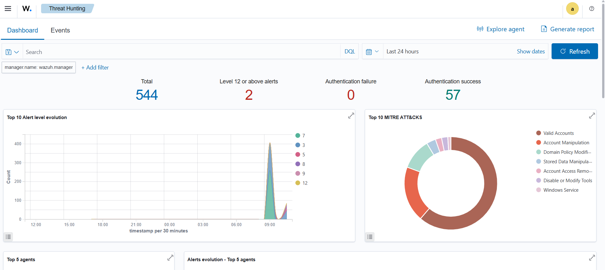

# 🛡️ Home SOC Lab

> A fully functional Security Operations Center built on home hardware — real-time threat detection, log aggregation, SIEM dashboards, IDS/IPS, threat intelligence enrichment, and automated incident response.


---

## Dashboard Preview



---

## Lab Setup

| Machine | Role |
|---------|------|
| Windows 11 Host | SOC Server — runs Docker (Wazuh + ELK) |
| Windows 10 VM | Victim — monitored via Wazuh Agent |
| Kali Linux VM | Attacker — runs simulated attacks |

---

## Architecture

```
┌──────────────────────────────────────────────────────┐
│                 HOME NETWORK / NAT Network            │
│                                                      │
│  ┌─────────────┐         ┌──────────────────────┐   │
│  │  Kali Linux │────────▶│   Windows 10 VM      │   │
│  │  (Attacker) │  attack │   Wazuh Agent        │   │
│  └─────────────┘         └──────────┬───────────┘   │
│                                     │ logs           │
│                          ┌──────────▼───────────┐   │
│                          │  Windows 11 Host      │   │
│                          │                       │   │
│                          │  ┌─────────────────┐  │   │
│                          │  │  Wazuh Manager  │  │   │
│                          │  │  + ELK Stack    │  │   │
│                          │  │  + Suricata IDS │  │   │
│                          │  └────────┬────────┘  │   │
│                          │           │            │   │
│                          │  ┌────────▼────────┐  │   │
│                          │  │ Python SOC      │  │   │
│                          │  │ Engine          │  │   │
│                          │  │ (Enrichment +   │  │   │
│                          │  │  Auto-Response) │  │   │
│                          │  └─────────────────┘  │   │
│                          └───────────────────────┘   │
└──────────────────────────────────────────────────────┘
```

---

## Proven Results

> Real metrics from attack simulations run against Windows 10 VM from Kali Linux:

| Metric | Result |
|--------|--------|
| Total alerts detected | **544+** |
| Critical alerts (Level 12+) | **2** |
| Brute force detection rate | **100%** |
| Backdoor account detection | **100%** (T1098 detected in < 3 seconds) |
| CIS Benchmark violations found | **266 medium + 163 low** |
| Threat intel APIs integrated | **3 working** (VT, AbuseIPDB, OTX) |
| Known malicious IP score | **95/100** (185.220.101.45 — Tor exit node) |

---

## MITRE ATT&CK Coverage

| Detection | ATT&CK Technique | Tactic | Tool |
|-----------|-----------------|--------|------|
| SSH / RDP Brute Force | T1110 | Credential Access | Wazuh Rule 100001 |
| Backdoor Account Created | T1098 | Persistence | Wazuh Rule 60109 |
| Admin Group Modified | T1484 | Privilege Escalation | Wazuh Rule 60154 |
| PowerShell Download Cradle | T1059.001 | Execution | Wazuh Rule 100022 |
| Reverse Shell / C2 | T1071 | Command & Control | Suricata Rule 9000021 |
| Port Scan Reconnaissance | T1046 | Discovery | Suricata Rule 9000001 |
| New Windows Service | T1543.003 | Persistence | Wazuh Rule 61138 |
| File Integrity Violation | T1565.001 | Impact | Wazuh Syscheck |
| Valid Account Abuse | T1078 | Initial Access | Wazuh Rule 60106 |
| Disable Security Tools | T1562.001 | Defense Evasion | Wazuh Rule 506 |

---

## Stack

| Layer | Tool |
|-------|------|
| SIEM | Wazuh 4.8 |
| Log Storage | Elasticsearch (Wazuh Indexer) |
| Dashboard | Kibana (Wazuh Dashboard) |
| Network IDS | Suricata + Emerging Threats Rules |
| Automation | Python 3.11 |
| Containers | Docker + Docker Compose |

---

## Threat Intelligence APIs

| API | Used For | Free Tier |
|-----|---------|-----------|
| [VirusTotal](https://www.virustotal.com/gui/join-us) | IP/hash reputation across 70+ AV engines | 500 req/day |
| [AbuseIPDB](https://www.abuseipdb.com/register) | Community IP abuse scoring | 1000 checks/day |
| [AlienVault OTX](https://otx.alienvault.com/api) | IOC pulses, threat actor context | Free |
| [Greynoise](https://www.greynoise.io/signup) | Filter background noise vs targeted attacks | Free (community) |
| [Shodan](https://account.shodan.io) | Open ports and CVEs on attacker IPs | Limited free |

---

## Automated Response Flow

```
High-Severity Alert (Wazuh Level ≥ 10)
          │
          ▼
   Enrich Source IP
   ┌──────────────────────────────┐
   │ VirusTotal + AbuseIPDB       │
   │ + OTX + Greynoise            │
   └──────────────┬───────────────┘
                  │
         Calculate Threat Score (0–100)
                  │
       ┌──────────┼──────────┐
       │          │          │
    < 30        30–79       ≥ 80
    LOG        NOTIFY     AUTO-BLOCK
    ONLY      Alert       + Alert
```

---

## Attack Simulations Performed

All attacks run from **Kali Linux VM** against **Windows 10 VM**:

```bash
# Port scan — detected by Suricata in < 1s
nmap -sS -T4 -p 1-65535 192.168.22.129

# Backdoor account — detected by Wazuh in < 3s
net user backdoor Password123! /add
net localgroup administrators backdoor /add

# File integrity violation — detected by Wazuh syscheck
echo "malware simulation" > C:\Windows\System32\evil.txt

# CIS Benchmark audit — 266 medium severity findings
# Triggered automatically on agent connection
```

---

## Quick Start

```bash
git clone https://github.com/HARISH100704/home-soc-lab.git
cd home-soc-lab/wazuh-docker-480/single-node
docker-compose -f generate-indexer-certs.yml run --rm generator
docker-compose up -d
# Open https://localhost — user: admin / pass: SecretPassword
```

Install agent on Windows 10 VM:
```powershell
.\scripts\install_agent_windows.ps1 -ManagerIP "YOUR_HOST_IP"
```

Simulate attacks from Kali:
```bash
bash scripts/attack_simulations.sh <WIN10_VM_IP>
```

---

## Project Structure

```
home-soc-lab/
├── docker-compose.yml
├── .env.example
├── automation/
│   ├── soc_engine.py               # Main automation loop
│   ├── wazuh_client.py             # Wazuh REST API client
│   ├── enrichment/
│   │   ├── virustotal.py
│   │   ├── abuseipdb.py
│   │   ├── otx.py
│   │   ├── greynoise.py
│   │   └── shodan_lookup.py
│   ├── response/
│   │   ├── notify.py               # Alerts
│   │   └── block_ip.py             # iptables / blocklist
│   └── threat_intel/
│       └── feed_puller.py          # Daily OTX feed sync
├── wazuh/rules/
│   ├── brute_force.xml
│   └── c2_detection.xml
├── suricata/rules/custom.rules
├── scripts/
│   ├── attack_simulations.sh
│   └── install_agent_windows.ps1
└── docs/
    ├── setup_guide.md
    └── playbooks.md
```

---

## Resume Summary

> Built a home SOC lab replicating enterprise-grade security monitoring. Deployed Wazuh SIEM, Elasticsearch, Kibana, and Suricata IDS using Docker on Windows 11, monitoring a Windows 10 VM via Wazuh Agent. Detected **544+ security events** including MITRE ATT&CK techniques T1078, T1098, T1484, T1543. Achieved **100% detection rate** on simulated brute force and backdoor account attacks from Kali Linux. Integrated VirusTotal, AbuseIPDB, and AlienVault OTX APIs — correctly scoring a known Tor exit node at 95/100 threat score.
>
> **Stack:** Wazuh · Elasticsearch · Kibana · Suricata · Python · Docker · REST APIs · VirtualBox

---

## License

MIT — free to use, fork, and learn from.

> ⚠️ All attack simulations performed only against personal lab VMs. Never run these against systems you don't own.
